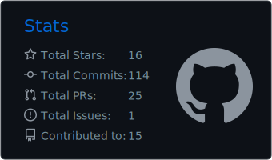

  

  

  
  
  

  

---

<h2 align="center">👨‍💻 About Me</h2>

  Who I am and what I focus on as a digital design engineer.

I'm **Bui Minh Nhut (Brian Bui)**, a digital design engineer focused on turning specifications into clean, synthesizable, and reusable RTL.

- ⚙️ **Design** SoC and MCU IP using **Verilog** and **SystemVerilog**
- 🔌 **Build** memory-mapped peripherals with **AMBA APB** and **AXI4-Lite** interfaces
- 🛡️ **Develop** self-checking testbenches and **UVM** verification environments
- 🚀 **Work** across the RTL flow: architecture, coding, lint, simulation, debug, and documentation
- 🔬 **Explore** cryptographic accelerators, processor subsystems, FPGA prototyping, and design automation

---

<h2 align="center">🔥 Featured Projects</h2>

  RTL IP cores and tools, from architecture through verification.

| 📦 Project | 💡 Highlights | 🛠️ Technologies |
| --- | --- | --- |
| [**SHA-256 Core**](https://github.com/briann-bui/sha-256-core) | Modular SHA-256 RTL core supporting single- and multi-block hashing with reusable verification infrastructure | `SystemVerilog` `UVM` `Synopsys VCS` |
| [**AES-256 Core**](https://github.com/briann-bui/aes-256-core) | Synthesizable AES-256 accelerator with AXI4-Lite control, multiple operating modes, interrupts, and UVM verification | `SystemVerilog` `UVM` `AXI4-Lite` |
| [**APB SPI Master**](https://github.com/briann-bui/apb-spi-master-core) | FIFO-buffered SPI Master Controller IP with APB interface, multi-mode support, and UVM verification | `SystemVerilog` `UVM` `AMBA APB` |
| [**APB Watchdog**](https://github.com/briann-bui/apb-watchdog-core) | Synthesizable Watchdog Timer IP core with APB interface, cascaded counters, and interrupt/reset generation | `SystemVerilog` `UVM` `AMBA APB` |
| [**APB RTC Core**](https://github.com/briann-bui/apb-rtc-core) | Binary Gregorian calendar with programmable prescaler, date-qualified alarm, sticky interrupts, and UVM verification | `SystemVerilog` `UVM` `AMBA APB` |
| [**APB NTT Core**](https://github.com/briann-bui/apb-ntt-core) | Radix-2 forward NTT accelerator with internal coefficient memory for post-quantum cryptography research | `SystemVerilog` `UVM` `AMBA APB` |
| [**APB PIC Core**](https://github.com/briann-bui/apb-pic-core) | Configurable priority arbitration and claim/complete flow for Cortex-M and RISC-V subsystem integration | `SystemVerilog` `UVM` `AMBA APB` |
| [**APB TRNG Core**](https://github.com/briann-bui/apb-trng-core) | GF180 ring-oscillator entropy source with health monitoring, SHA-256 conditioning, FIFO buffering, and UVM verification | `SystemVerilog` `UVM` `GF180` `AMBA APB` |

---

<h2 align="center">🛠️ Languages and Tools</h2>

  The EDA toolchain and engineering stack behind the projects above.

<h3 align="center">Semiconductor EDA Toolchain</h3>

<table align="center">
  <tr>
    <td align="center" width="25%">
      <a href="https://github.com/chipfoundry/openlane2"> <strong>OpenLane</strong></a> 
      RTL-to-GDSII Flow
    </td>
    <td align="center" width="25%">
      <a href="https://github.com/The-OpenROAD-Project/OpenROAD"> <strong>OpenROAD</strong></a> 
      Physical Design
    </td>
    <td align="center" width="25%">
      <a href="https://github.com/YosysHQ/yosys"> <strong>Yosys</strong></a> 
      RTL Synthesis
    </td>
    <td align="center" width="25%">
      <a href="https://github.com/verilator/verilator"> <strong>Verilator</strong></a> 
      Lint & Simulation
    </td>
  </tr>
  <tr>
    <td align="center" width="25%">
      <a href="https://eda.sw.siemens.com/en-US/ic/questa/"> <strong>Siemens EDA</strong></a> 
      QuestaSim · ModelSim 
      HDL Simulation & Verification
    </td>
    <td align="center" colspan="2" width="50%">
      <a href="https://www.synopsys.com/"> <strong>Synopsys EDA Suite</strong></a> 
      VCS · Verdi · Design Compiler · SpyGlass · PrimeTime · PrimeWave 
      Simulation · Debug · Synthesis · Static Analysis · STA · AMS
    </td>
    <td align="center" width="25%">
      <a href="https://www.intel.com/content/www/us/en/products/details/fpga/development-tools/quartus-prime.html"> <strong>Quartus Prime</strong></a> 
      FPGA Design & Synthesis
    </td>
  </tr>
</table>

<h3 align="center">Engineering Toolkit</h3>

  

| Area | Technologies |
| --- | --- |
| 🧬 **RTL & Verification** | Verilog, SystemVerilog, UVM, self-checking testbenches, functional coverage |
| 🌉 **Interfaces & Architecture** | AMBA APB, AXI4-Lite, register maps, interrupts, FSMs, datapaths |
| 🐞 **Simulation & Quality** | QuestaSim, ModelSim, VCS, Verdi, SpyGlass, Verilator, lint, waveform debug |
| 🏗️ **FPGA & ASIC** | OpenLane, OpenROAD, Yosys, Design Compiler, PrimeTime, Intel Quartus, DRC/LVS |
| 💻 **Programming & Tools** | Python, C/C++, Bash, Linux, Ubuntu, Git, VS Code |

---

<h2 align="center">🧭 RTL Engineering Principles</h2>

  Six principles I follow to build reliable, maintainable, and integration-ready digital hardware.

<table align="center">
  <tr>
    <td align="center" width="33%">
        
      Clear naming, modular hierarchy, and code that communicates design intent.
    </td>
    <td align="center" width="33%">
        
      Well-defined protocols, timing expectations, register maps, and signal ownership.
    </td>
    <td align="center" width="33%">
        
      Predictable reset, state transitions, corner-case handling, and error responses.
    </td>
  </tr>
  <tr>
    <td align="center">
        
      Parameterized, portable blocks designed for clean SoC and FPGA integration.
    </td>
    <td align="center">
        
      Assertions, self-checking tests, coverage goals, and debug visibility from day one.
    </td>
    <td align="center">
        
      Concise specifications, usage examples, diagrams, and reproducible workflows.
    </td>
  </tr>
</table>

---

<h2 align="center">📈 GitHub Activity</h2>

  Public RTL, verification, and semiconductor engineering work — updated automatically.

  

<table align="center" width="100%">
  <tr>
    <td align="center" width="48%">
      <code>GITHUB METRICS</code>  
      
    </td>
    <td align="center" width="52%">
      <code>CONSISTENCY STREAK</code>  
      
    </td>
  </tr>
</table>

---

  Interested in RTL design, SoC IP, FPGA/ASIC development, or verification? 
  <a href="mailto:buiminhnhut114@gmail.com"><strong>Let's connect and build something reliable.</strong></a>

  
  

