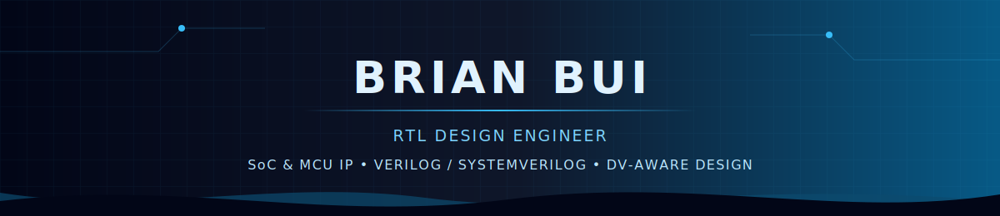

  

  I build reusable, verification-friendly RTL IP for FPGA and ASIC systems.

  
  
  

  

---

## About Me

I'm **Bui Minh Nhut (Brian)**, a digital design engineer focused on turning specifications into clean, synthesizable, and reusable RTL.

- Design SoC and MCU IP using **Verilog** and **SystemVerilog**
- Build memory-mapped peripherals with **AMBA APB** and **AXI4-Lite** interfaces
- Develop self-checking testbenches and **UVM** verification environments
- Work across the RTL flow: architecture, coding, lint, simulation, debug, and documentation
- Explore cryptographic accelerators, processor subsystems, FPGA prototyping, and design automation

## Featured Projects

| Project | Highlights | Technologies |
| --- | --- | --- |
| [AES-256 Cryptographic IP Core](https://github.com/briann-bui/aes_256) | Synthesizable AES-256 core with AXI4-Lite, six operating modes, interrupts, and a UVM verification environment | SystemVerilog, UVM, AXI4-Lite, Verilator, ModelSim |
| [SHA-256 Core](https://github.com/briann-bui/sha_engine_core) | Modular SHA-256 RTL core with single- and multi-block hashing and direct-port UVM smoke tests | SystemVerilog, UVM, Synopsys VCS |
| [64-bit Timer IP](https://github.com/briann-bui/64bit-Timer-IP-Design) | APB timer peripheral with byte access, wait states, error handling, programmable prescaling, and interrupts | Verilog, AMBA APB, QuestaSim |
| [NTT Engine Core](https://github.com/briann-bui/ntt-engine-core) | Hardware-oriented Number Theoretic Transform engine for arithmetic acceleration | SystemVerilog, RTL Design |
| [Verilog FSM Generator](https://github.com/briann-bui/verilog-fsm-generator) | Python tool that generates Verilog finite-state machines from CSV or XLSX transition tables | Python, Verilog, Automation |
| [6T SRAM Cell Design](https://github.com/briann-bui/6T-SRAM-Cell-Design) | 90 nm SRAM cell flow from schematic and simulation through layout, DRC/LVS, and post-layout analysis | Synopsys EDA, PrimeWave, CMOS |

## Languages and Tools

<h3 align="center">Semiconductor EDA Toolchain</h3>

<table align="center">
  <tr>
    <td align="center" width="25%">
      <a href="https://github.com/chipfoundry/openlane2"> <strong>OpenLane</strong></a> 
      RTL-to-GDSII Flow
    </td>
    <td align="center" width="25%">
      <a href="https://github.com/The-OpenROAD-Project/OpenROAD"> <strong>OpenROAD</strong></a> 
      Physical Design
    </td>
    <td align="center" width="25%">
      <a href="https://github.com/YosysHQ/yosys"> <strong>Yosys</strong></a> 
      RTL Synthesis
    </td>
    <td align="center" width="25%">
      <a href="https://github.com/verilator/verilator"> <strong>Verilator</strong></a> 
      Lint & Simulation
    </td>
  </tr>
  <tr>
    <td align="center" width="25%">
      <a href="https://eda.sw.siemens.com/en-US/ic/questa/"> <strong>Siemens EDA</strong></a> 
      QuestaSim · ModelSim 
      HDL Simulation & Verification
    </td>
    <td align="center" colspan="2" width="50%">
      <a href="https://www.synopsys.com/"> <strong>Synopsys EDA Suite</strong></a> 
      VCS · Verdi · Design Compiler · SpyGlass · PrimeTime · PrimeWave 
      Simulation · Debug · Synthesis · Static Analysis · STA · AMS
    </td>
    <td align="center" width="25%">
      <a href="https://www.intel.com/content/www/us/en/products/details/fpga/development-tools/quartus-prime.html"> <strong>Quartus Prime</strong></a> 
      FPGA Design & Synthesis
    </td>
  </tr>
</table>

<h3 align="center">HDL & Automation</h3>

  
  
  
  
  

## Engineering Toolkit

| Area | Technologies |
| --- | --- |
| RTL & Verification | Verilog, SystemVerilog, UVM, self-checking testbenches, functional coverage |
| Interfaces & Architecture | AMBA APB, AXI4-Lite, register maps, interrupts, FSMs, datapaths |
| Simulation & Quality | QuestaSim, ModelSim, VCS, Verdi, SpyGlass, Verilator, lint, waveform debug |
| FPGA & ASIC | OpenLane, OpenROAD, Yosys, Design Compiler, PrimeTime, Intel Quartus, DRC/LVS |
| Programming | Python, C#, Java, MATLAB, SQL |
| Environment | Linux, Git, Make, shell scripting |

<h2 align="center">◈ RTL Engineering Principles</h2>

  Six principles I follow to build reliable, maintainable, and integration-ready digital hardware.

<table align="center">
  <tr>
    <td align="center" width="33%">
        
      Clear naming, modular hierarchy, and code that communicates design intent.
    </td>
    <td align="center" width="33%">
        
      Well-defined protocols, timing expectations, register maps, and signal ownership.
    </td>
    <td align="center" width="33%">
        
      Predictable reset, state transitions, corner-case handling, and error responses.
    </td>
  </tr>
  <tr>
    <td align="center">
        
      Parameterized, portable blocks designed for clean SoC and FPGA integration.
    </td>
    <td align="center">
        
      Assertions, self-checking tests, coverage goals, and debug visibility from day one.
    </td>
    <td align="center">
        
      Concise specifications, usage examples, diagrams, and reproducible workflows.
    </td>
  </tr>
</table>

<h2 align="center">◈ GitHub Activity</h2>

  

  
  

  

  

---

  Interested in RTL design, SoC IP, FPGA/ASIC development, or verification? 
  <a href="mailto:buiminhnhut114@gmail.com"><strong>Let's connect and build something reliable.</strong></a>

